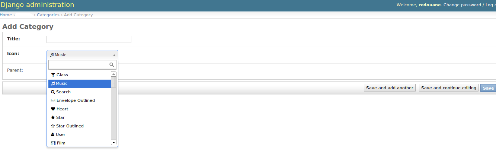

==================
django-fontawesome
==================

.. image:: https://badge.fury.io/py/django-fontawesome.svg
    :target: http://badge.fury.io/py/django-fontawesome

.. image:: https://pypip.in/download/django-fontawesome/badge.png
    :target: https://pypi.python.org/pypi/django-fontawesome/
    :alt: Downloads

.. image:: https://pypip.in/license/django-fontawesome/badge.png
    :target: https://pypi.python.org/pypi/django-fontawesome/
    :alt: License

PS: still under developement, things may change, once stable it will be on PyPI.

django-fontawesome is a django app that provides a couple of fontawesome/django related utilities, namely:

- an IconField to associate fontawesome icons with model instances
- templatetags to render fontawesome icons

also included:

- admin support for the IconField
- fr locale translation

Requirements
============

- PyYAML
- Select2 (included)
- JQuery (uses django's jquery in admin panel)

Settings
========
by default, django-fontawesome ships with/uses the lastest fontawesome release.
you can configure django-fontawesome to use another release/source/cdn by using::

    FONTAWESOME_CSS_URL # default uses locally shipped version at 'fontawesome/css/font-awesome.min.css'
    FONTAWESOME_CSS_URL = '//cdn.example.com/fontawesome-min.css' # absolute url
    FONTAWESOME_CSS_URL = 'myapp/css/fontawesome.min.css # relative url

you can also tell it the fontawesome prefix, which as of right now is 'fa', using::

    FONTAWESOME_PREFIX # default is 'fa'

Installation / Usage
====================

1. add 'fontawesome' to your installed apps setting like this::

    INSTALLED_APPS = (
        ...
        'fontawesome',
    )

2. import and use the iconfield::
    
    from fontawesome.fields import IconField

    class Category(models.Model):
        ...
        icon = IconField()

Optionally, you may include or exclude specific icons for the `IconField` by passing one of two keyword arguments: `only_ids` or `exclude_ids` which are lists of strings corresponding to the FontAwesome icon ids in `icons.yml`

To only include specific icons:

    class Category(models.Model):
        ...
        icon = IconField(only_ids=['music', 'heart', 'star'])

or to exclude specific icons:

    class Category(models.Model):
        ...
        icon = IconField(exclude_ids=['volume-off', 'volume-down'])

here's what the widget looks like in the admin panel:

|admin-widget|

3. you can then render the icon in your template like this::
    
    
        
            {{ category.icon.as_html }}
        
    

4. django-fontawesome ships with two template tags, `fontawesome_stylesheet` and `fontawesome_icon`.
    - the former inserts a stylesheet link with a pre-configured href according to the FONTAWESOME_CSS_URL setting
    - the latter renders icons, and accepts the following optional keywords arguments: large, spin, fixed, li, border: (true/false), rotate: (90/180/270)
    - you can also colorize an icon using the color='red' keyword argument to the fontawesome_icon template tag

    ::

       
    
       <head>
          
         ...
       </head>
     
       

       
    
       <ul class="fa-ul">
          <li>  One</li>
       </ul>

5. profit!!!

changelog
=========

Oct 10, 2015
------------
- Added the ability to include or exclude specific FontAwesome icons by id when defining the IconField on a model
- Added unit tests for the IconField

Sep 11, 2015
------------
- Updated locally shipped fontawesome to 4.4.0

Feb 27, 2015
------------
- added two new keyword argument to the fontawesome_icon template tag, color and border
- FONTAWESOME_PREFIX setting is now taken into account when rendering icons using the fontawesome_icon template tag
